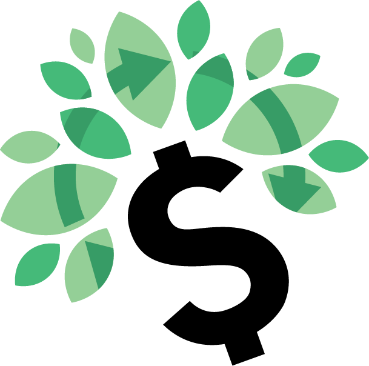

# RentCycle



## The Problem

**The world faces an overconsumption crisis**. We buy tons of stuff only to throw them away, filling up landfills in pumping CO2 into the planet’s water and skies. As our addiction to buying grows, manufacturers cut corners with environmentally unfriendly practices to meet demand.

Why does overconsumption matter? Because **consumerism is driving 60% of global greenhouse gas emissions and creating up to 80% of total land, material, and water waste**. What’s worse is that we’re responsible—**ordinary households like yours and mine contribute up to 80% of that**. _[1]_

You’re probably wondering what individuals like you or me can do. After all, it seems like consumption is part of human nature. And besides, isn’t this a problem for governments and global institutions?

Let's take a look at the **sharing economy**: the economic system in which people borrow and lend goods and services. If you’ve used Uber, Airbnb, or Postmates before, you’ve already a part of it!

Research has shown that applying the principles of the sharing economy to everyday items—as in _ borrowing _ instead of _buying_ goods—can have a tremendous environmental impact. _[2],[3]_ 

But so far, there's been **no scalable platform for lending and borrowing ordinary items**.

_[1]: Ivanova et al. "Environmental Impact Assessment of Household Consumption." Journal of Industrial Ecology. 2015._
_[2]: Columbia University, Earth Institute. "The Sharing Economy is Transforming Sustainability." 2017.
_[3]: IDDRI. "Study: The sharing economy: make it sustainable."  Studies N°03/14. 2014._ 

## The Solution

That’s why we made **Rentcycle**: the online marketplace for local and eco-friendly sharing.

Rentcycle is a platform for sharing everyday goods with your neighbors. With Rentcycle, you can get the stuff you need while _consuming responsibly_, _saving money_, and _supporting your communities_!

**Borrowing** and **lending** instead of **buying** and **spending** cut down on carbon-intensive consumerism while supporting your local community and your bank account.

## The Product

Rentcycle is super easy to use! Whether you’re borrowing or lending, **you only need 3 steps**.

If you’re borrowing, all you’ve gotta do is:
1. _Find_: request anything—from power tools to bicycles to 3D printers!
2. _Book_: schedule your item for a chosen time or date.
3. _Use & Return_: enjoy your return responsibly and return it.

And if you’re on the other side lending, you can:
1. _List_: pick out your items with your pricing.
2. _Approve & Lend_: accept rental requests and lend out.
3. _Cash Out_: get paid once the rental starts!

Rentcycle’s points-based system assigns value to exchanged items, so users can later spend those points to rent out other items and keep using the platform.

We used Flutter, Google’s UI toolkit, to develop a consistent and beautiful mobile and web interface. The application interfaces with the Google Cloud Platform to aggregate and serve data to users.

## The Impact

Rentcycle is awesome for three reasons:

_The Environment:_ Rentcycle is universal, so you can use it to borrow almost anything! This makes it so that anybody can help curb overconsumption, improving the environment in the process. **Renting items halts our reliance on costly manufacturing that pollutes our air and water**. _[1],[2]_ By forgoing that one Amazon order, you’ve stopped another addition to the landfill.

_The Community:_ Rentcycle has amazing potential to improve local communities with the power of sharing. Borrowing and lending to neighbors can strengthen our communities and help us develop meaningful relationships. **We build trust, break down social barriers, and work together to clean the environment**.

_The Individual:_ Let’s not forget that **YOU are saving and making money through Rentcycle**. Lenders earn money by renting out their stuff, and borrowers save money by paying less for things they only need temporarily. This combination of supply- and demand-side incentives makes Rentcycle highly scalable and sustainable.

## Installation

First install [flutter](https://flutter.dev/docs/get-started/install).

You should also set up a Firestore project. Follow the instructions at https://pub.dev/packages/cloud_firestore to obtain the `google-services.json` file. Then, create a new file in `libs/` called `keys.dart` with the following (replacing values as appropriate):

```dart
import 'package:firebase_core/firebase_core.dart';

final AppFirebaseOptions = FirebaseOptions(
    googleAppID: "your project Google app ID",
    apiKey: "your project API key",
    databaseURL: "your project database URL",
    projectID: "your project id"
);
```

You're all set to build and run the project! Simply run `flutter run` to see the magic happen.